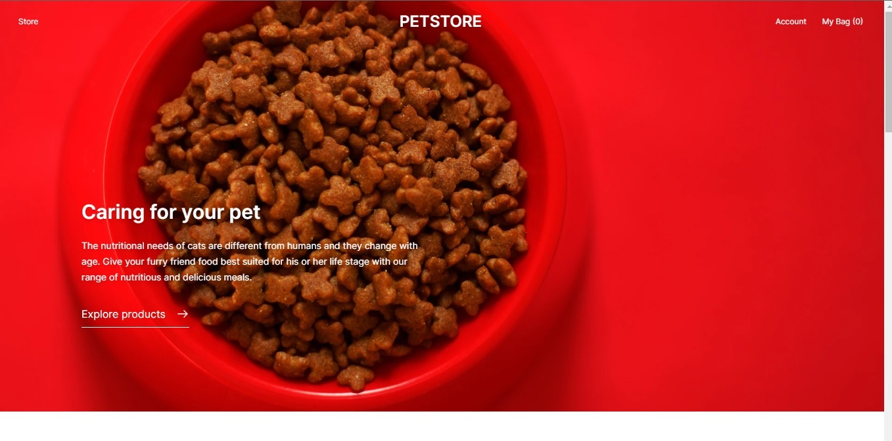
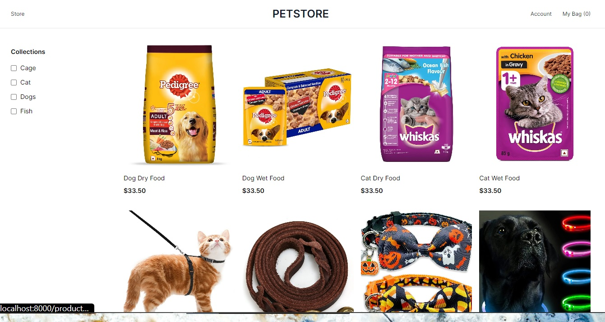
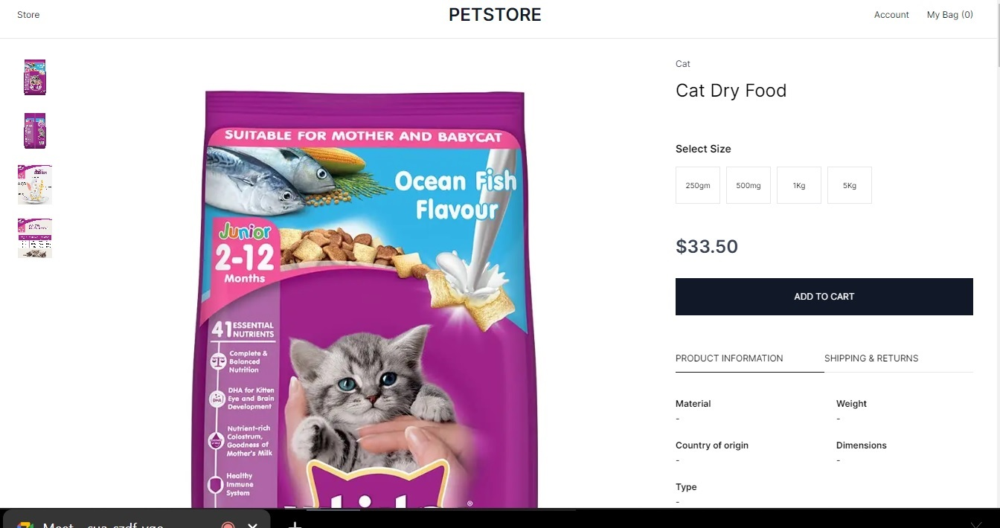
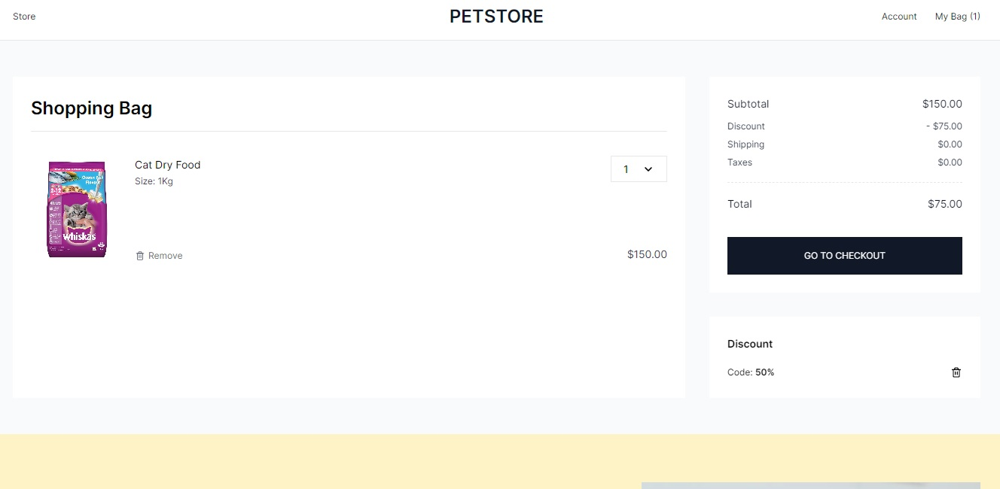
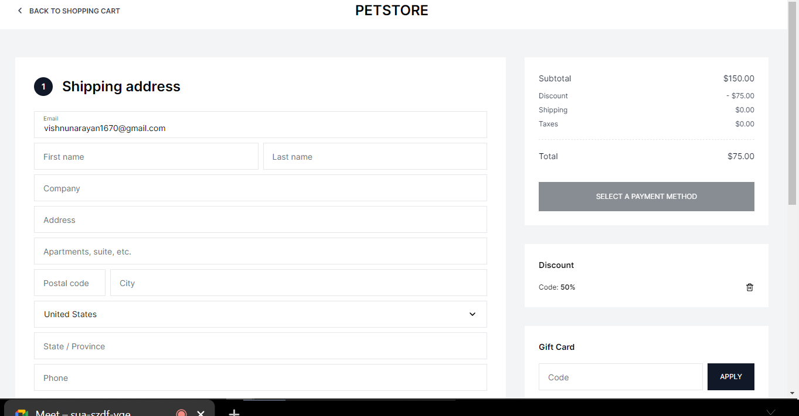
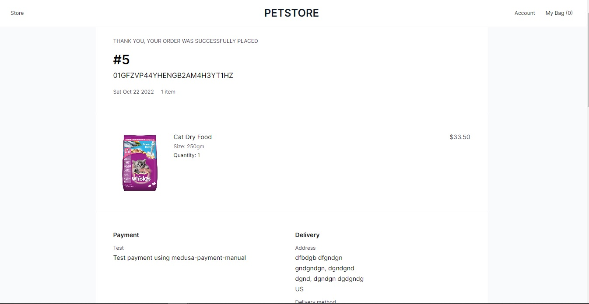
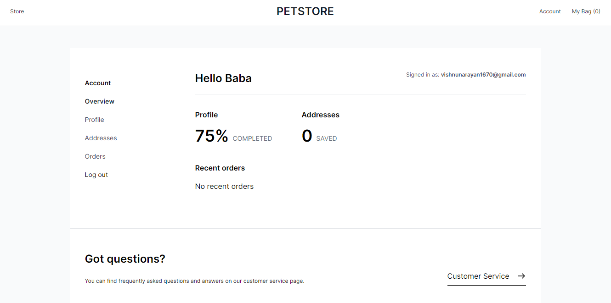

# Petmart
  A Pet shop made using Medusa framework and Next.js storefront
  
  

## About
  ### Participants
  | Name |  |||
  | --- | --- | --- | --- |
  |Vishnu Rai | [@Narayan1670](https://github.com/Narayan1670)|Narayan1670#1672|[@VishnuR00911692](https://twitter.com/VishnuR00911692)|
  |Leofierus | [@Leofierus](https://github.com/Leofierus)|Leo🦋#7371|[@leofierus](https://twitter.com/leofierus)|
  |Vaibhav Gupta | [@Dynomin](https://github.com/Dynomin)|StarBrawler#9151|[@Vaibhav56884486](https://twitter.com/Vaibhav56884486)|
  |Teri Eyenike | [@Terieyenike](https://github.com/terieyenike)|teri#9963|[@terieyenike](https://twitter.com/terieyenike)|
  |Eluda | [@eludadev](https://github.com/eludadev)|eluda#4050|[@eludadev](https://twitter.com/eludadev)|
  
  ### Description
  Petmart is a pet store application developed using Next.Js and MedusaJs to bring out the capabilities of what MedusaJS can attain.
  
  ### Project Preview
#### Gifs


#### Screenshots













  
  
## Project Setup
  ### Prerequisites
  Before you start with the tutorial make sure you have

  - [Node.js](https://nodejs.org/en/) v16.9.0 or greater installed on your machine ([NVM](https://github.com/coreybutler/nvm-windows) is a great tool for installing Node packages in Windows)
  - Medusa fully set up (along with Medusa CLI)
```
yarn global add @medusajs/medusa-cli
```

  ### Cloning and executing the code
1. Clone the repo
```
git clone https://github.com/Narayan1670/PetMart
```
2. If you have the tools required in [Prerequisites](#prerequisites), you will be able to execute the entire application using the following:
```
-> Backend
cd my-medusa-store/backend
# Install dependencies
yarn install
# Start the app
yarn start

-> Admin
cd my-medusa-store/admin
# Install dependencies
yarn install
# Start the app
yarn start

-> Storefront
cd my-medusa-store/storefront
# Install dependencies
yarn install
# Start the app
yarn start
```

## Resources
- [Medusa’s GitHub repository](https://github.com/medusajs/medusa)
- [Medusa Documentation](https://docs.medusajs.com/)
